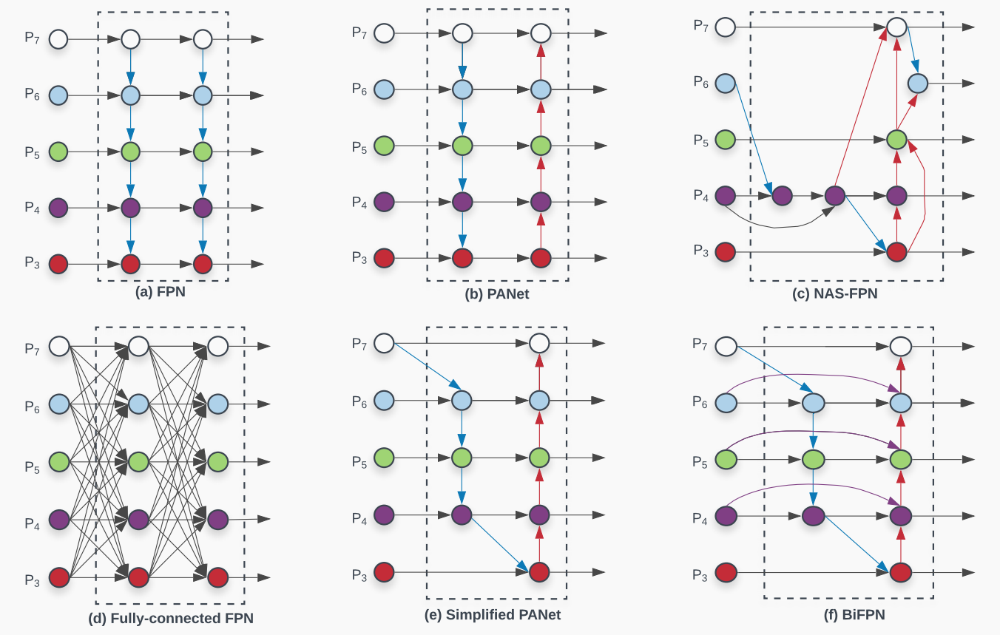
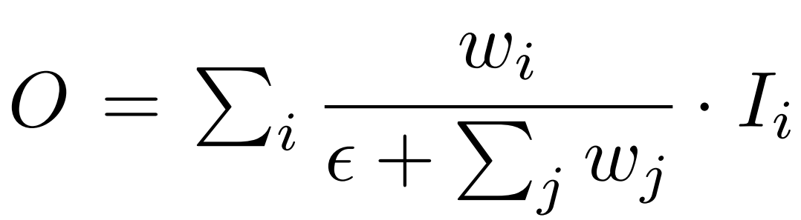
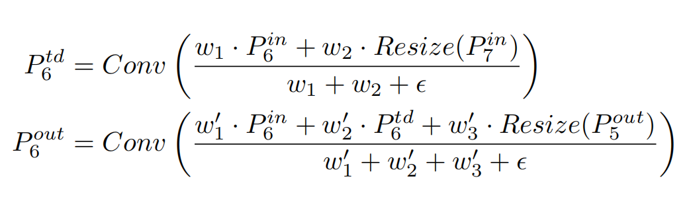
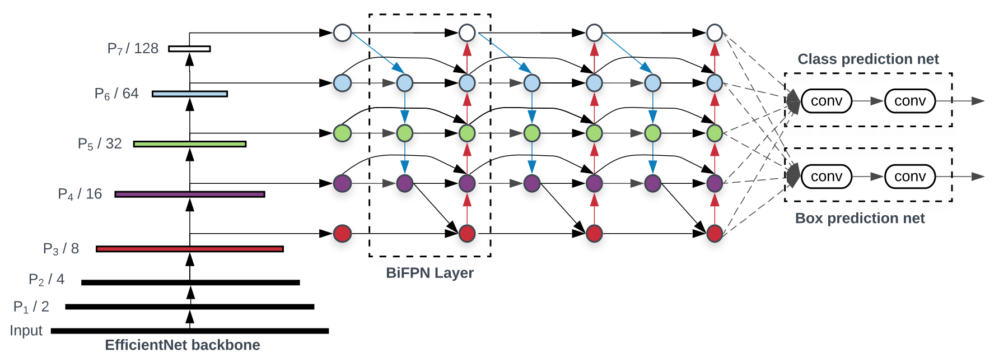
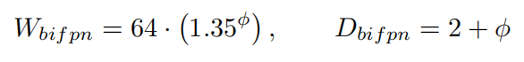
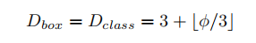
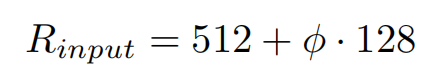
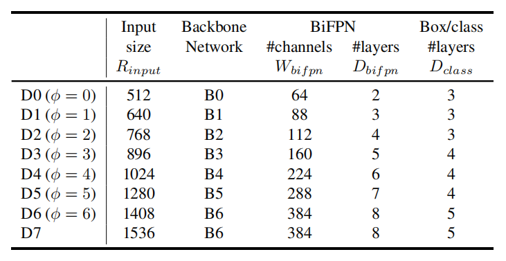
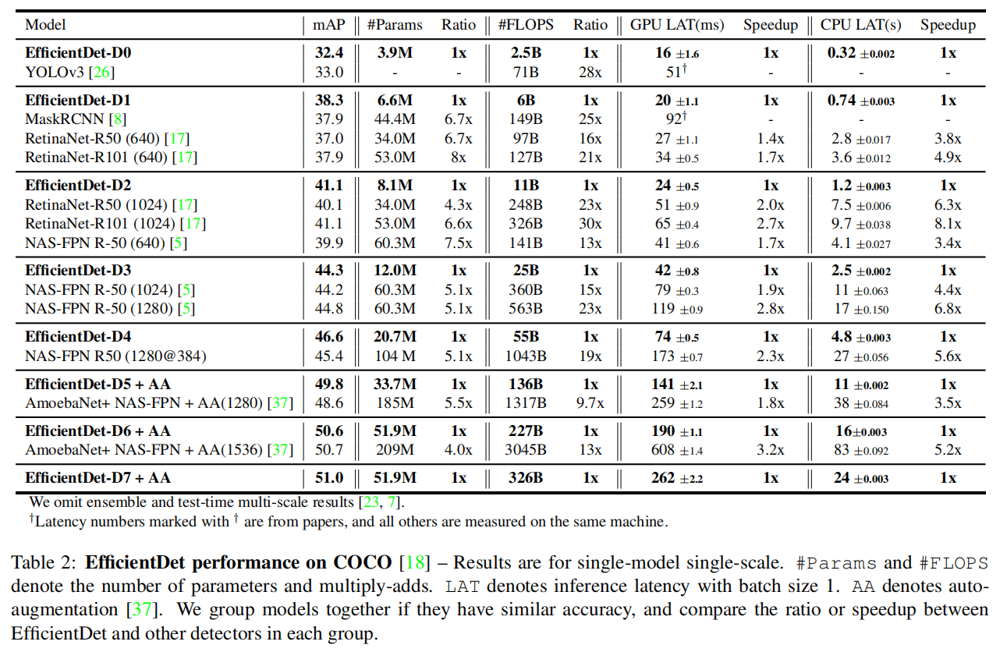

# EfficientDet: Scalable and Efficient Object Detection
## 一、摘要
提出了两种优化模型效率的方法
- 提出带权重的双向特征金字塔网络BiFPN，用于更简单快捷地进行特征融合。
- 提出了一种复合缩放方法，该方法可以同时对主干网络、特征提取网络以及预测类别和坐标的网络中的分辨率、深度、宽度进行统一地缩放。

提出了新的目标检测框架EfficientDet。
值得一提的是，EfficientDet-D7在COCO数据集上mAP达到51.0的同时，参数量只有52M并且FLOPS为326B，
相比之前最好的检测模型参数量小了4倍，FLOPS小了9倍，mAP上升了0.3%。

## 二、BiFPN

### 针对多尺度连接的优化建议
- 首先提出了，删除只有一个输入边的结点，因为单边输入的结点不存在特征融合，对特征融合网络来说贡献就非常小。
如上图e的简化版PANet

- 接着对于同一水平的结点，会额外增加一条从源结点指向输出结点的边，如上图的f。在增加少量消耗的同时融合更多的特征。

- 最后把上图e这样一条自上而下和一条自下而上的路径组合起来的双向路径作为一个特征网络层，重复这样的层就能获得更好的特征融合。

### 针对尺度融合的优化
**不同分辨率、不同阶段的特征对输出结果的贡献大小不同，提出加权的特征融合**

- 选择标量作为权重，比标量、tensor计算开销小

- 对权重进行归一化，因为标量无界（没有方向），容易导致训练不稳定

- 采用上图公式中的归一化方式Fast normalized fusion。通过对每个权重ω后面进行一次Relu激活，保证权重都大于等于0；ε=0.0001避免数值不稳定。
这样权重的值会归一化为0到1之间。这里没有直接采用softmax，因为softmax需要大量额外的计算。在作者后续的消融（类似剪枝）学习中，
发现这种方法可以达到和softmax非常接近的表现和精度，并且在GPUs上快了30%。

### 举例

**这里是一个例子，可以结合上面最开始的图f进行理解。**

最终的BiFPN就是结合了双向的多尺度连接和快速归一化融合。
此外，为了提高模型效率，作者在特征融合中使用了深度可分离卷积，
在每次卷积后增加了批归一化处理和激活操作。

## 三、EfficientDet
### EfficientDet 结构

- backbone采用ImageNet预训练的EfficientNets

- feature network特征网络采用提出的BiFPN。
BiFPN使用了backbone的3到7层作为输入，并且重复使用自底向上、自顶向下的双向特征融合。

- 经过BiFPN融合的特征输入给最后的分类预测网络，分类预测网络的权重共享。

### 复合缩放
**针对目标检测提出一种新的复合缩放方法：
使用复合系数ф来统一缩放backbone、BiFPN、class/box以及分辨的所有维度。**
- backbone network：我们对EfficientNet-B0到B6使用相同的宽度/深度缩放系数，这样我们就可以使用他们的ImageNet的预训练模型

- BiFPN network：BiFPN的宽度Width（也就是通道数）以指数增长的方式增加，深度Depth以线性方式来增加

- Box/Class prediction network：始终保持宽度Width和BiFPN的Width相同，深度Depth以线性方式增加

- 输入图片分辨率：因为backbone的3-7层特征被用于BiFPN，所以输入图片大小必须为2的7次方（128）的倍数，
因此分辨率也是以线性方式增长

根据上面的方法，做出了一下的EfficientDetD0-D7的配置

其中当Φ≧7的时候，内存会不够除非改变batch size或者其他的设置，但是这样就不能进行对照比较了。
因此从D6增长到D7的配置中，仅仅增大了输入图片的尺寸，保持其他维度不变。

以下结果，是在单模型单尺度设置下并且没有在测试时增强，在COCO2017检测数据集的EfficientDet的表现，
同时比较了EfficientDet和其他目标检测模型。

